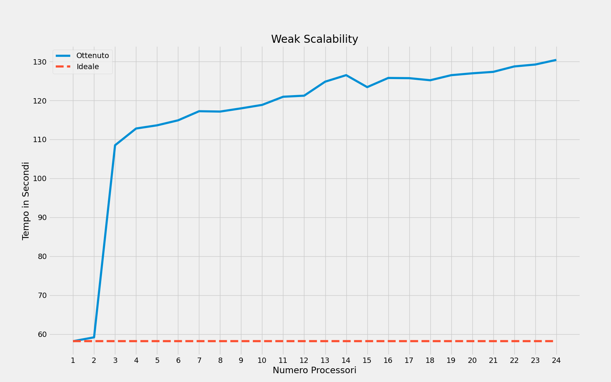

# MPI-GameOfLife - PCPC Project
**Studente**: Giuseppe Cardaropoli

**Matricola**: 0522501310
 
**Project ID**: 01310 % 5 == 0

## Indice
* [Introduzione](#introduzione)
* [Istruzioni per l'esecuzione](#istruzioni-per-lesecuzione)
	* [Compilazione](#compilazione)
	* [Esecuzione Locale](#esecuzione-locale)
	* [Esecuzione sul Cluster](#esecuzione-sul-cluster)
* [Descrizione della soluzione](#descrizione-della-soluzione)
* [Correttezza](#correttezza)
* [Benchmarks](#benchmarks)
	* [Weak Scalability](#weak-scalability)
	* [Strong Scalability](#strong-scalability)
* [Analisi dei risultati](#analisi-dei-risultati)

## Introduzione
**The Game of Life**, anche conosciuto come **Life**, è un automa cellulare sviluppato dal matematico inglese John Conway alla fine degli anni sessanta. Lo scopo è quello di mostrare come comportamenti simili alla vita possono nascere da regole semplici e da interazioni tra diversi corpi. Ad esempio, alcuni pattern ricordano la riproduzione cellulare, altri il volo di un aliante e così via.
Si tratta di un "**gioco senza giocatori**" in quanto la sua evoluzione dipende dalla configurazione iniziale e non richiederà nessun input. Questo gioco si svolge su una griglia bidimensionale dove ogni cella può trovarsi in due possibili stati: **viva** o **morta**. Gli stati di tutte le celle in una data generazione sono usati per calcolare lo stato delle celle nella generazione successiva. Quindi, tutte le celle vengono aggiornate simultaneamente. La transizione di stato di una cella dipende dallo stato dei suoi vicini:
- Qualsiasi cella viva con meno di due celle vive adiacenti muore, come per effetto d'isolamento;
- Qualsiasi cella viva con due o tre celle vive adiacenti sopravvive alla generazione successiva;
- Qualsiasi cella viva con più di tre celle vive adiacenti muore, come per effetto di sovrappopolazione;
- Qualsiasi cella morta con esattamente tre celle vive aciacenti diventa una cella viva, come per effetto di riproduzione.

## Istruzioni per l'esecuzione
### Compilazione
```
mpicc -g distribuited-game-of-life.c -o distribuited-game-of-life
```
### Esecuzione Locale 
```
mpirun --allow-run-as-root -np <np> distribuited-game-of-life <row> <col> <num_gen>
```
### Esecuzione sul Cluster 
```
mpirun --allow-run-as-root -np <np> --hostfile <host> distribuited-game-of-life <row> <col> <num_gen>
```
Sostituisci:
- **np**: numero di processori;
- **row**: numero righe della matrice di gioco;
- **col**: numero colonne della matrice di gioco;
- **num_gen**: numero di generazioni.
- **host**: il path dell'hostfile

## Descrizione della Soluzione
> **Assunzioni**: esistono diverse varianti del gioco. È stata considerata una matrice **non toroidale**. Quindi le celle ai bordi della matrice hanno 5 vicini, invece, quelle agli angoli solo 3. Inoltre, è stato deciso che il **master** costruibisce alla computazione.

Prima di iniziare il gioco vengono controllati i parametri dati in input dall'utente, riguardanti il numero di processori, grandezza della matrice e numero di generazioni. Successivamente vengono create tutte le strutture dati necessarie.

`matrix` è un array che rappresenta la matrice di gioco, il cui stato sarà inizializzato dal processore **master** in maniera pseudocasuale. La matrice di gioco è stata suddivisa per righe in maniera equa fra tutti i processi. La suddivisione viene effettuata con la funzione `MPI_Scatterv()` una volta aver calcolato i displacements e quanti elementi invare ad ogni processo.

Ogni processore avrà la prima e/o l'ultima riga della propria sottomatrice vincolate. Per questo motivo, all'inizio di ogni generazione avviene uno **scambio non bloccante** di righe tra processori vicini. Ogni processore tranne l'ultimo invia la propria ultima riga (`bottom_row`) al processore successivo ed ogni processore tranne il primo invia la sua prima riga (`top_row`) al processore precedente:
```c
if (rank > 0) {
	MPI_Isend(&process_matrix[0], col, MPI_INT, rank-1, rank-1, MPI_COMM_WORLD, &send_first_row);
	MPI_Irecv(top_row, col, MPI_INT, rank-1, rank, MPI_COMM_WORLD, &receive_prev_row);
}
if (rank < np-1) {
	MPI_Isend(&process_matrix[(local_row-1) * col], col, MPI_INT, rank+1, rank+1, MPI_COMM_WORLD, &send_last_row);
	MPI_Irecv(bottom_row, col, MPI_INT, rank+1, rank, MPI_COMM_WORLD, &receive_next_row);
}
````
Successivamente, ogni processore inizia a calcolare il nuovo stato delle righe non vincolate (se ci sono).
```c
start_row = (rank == 0) ? 0 : 1;
end_row = (rank == np-1) ? local_rows : local_rows-1;
update_generation(start_row, end_row, local_rows, cols, process_matrix, new_process_matrix, NULL, NULL);
```
In seguito, ogni processore inizia a calcolare il nuovo stato delle righe vincolate. Se la sottomatrice loca è composta da una sola riga allora sarà doppiamente vincolata. Altrimenti, avremo la prima e/o l'ultima riga vincolate.
```c
if (local_rows == 1) {
	if (rank > 0) MPI_Wait(&receive_prev_row, MPI_STATUS_IGNORE);
      	if (rank < np-1) MPI_Wait(&receive_next_row, MPI_STATUS_IGNORE);

	start_row = 0;
	update_generation(start_row, start_row+1, local_rows, cols, process_matrix, new_process_matrix, top_row, bottom_row);
}
else {
	if (rank > 0) {
		MPI_Wait(&receive_prev_row, MPI_STATUS_IGNORE);        
		
		start_row = 0;
		update_generation(start_row, start_row+1, local_rows, cols, process_matrix, new_process_matrix, top_row, bottom_row);
	}
	if (rank < np-1) {
	MPI_Wait(&receive_next_row, MPI_STATUS_IGNORE);
                
	start_row = local_rows-1;
	update_generation(start_row, start_row+1, local_rows, cols, process_matrix, new_process_matrix, top_row, bottom_row);
	}           
}
```
In ogni caso andiamo ad utilizzare la seguente funzione `update_generatio()`:
```c
void update_generation(int from, int to, int rows, int cols, int *process_matrix, int *new_process_matrix, int *top_row, int *bottom_row) {
    for (int i = from; i < to; i++) {
        for (int j = 0; j < cols; j++) {
            int alives = neighbors_alive(i, j, rows, cols, process_matrix, top_row, bottom_row);

            if (process_matrix[i * cols + j] == 1 && (alives == 2 || alives == 3)) {
                new_process_matrix[i * cols + j] = 1;
            }
            else if (process_matrix[i * cols + j] == 0 && alives == 3) {
                new_process_matrix[i * cols + j] = 1;
            }
            else new_process_matrix[i * cols + j] = 0;
        }
    }
}
```
Questa funzione utilizza a sua volta la funzione `neighbords_alive()` per calcolare il numero di vicini vivi per ogni cella. Tale funzione considera tutti i prossibili casi:
1. **cella non vincolata**: tutti i vicini sono locali;
3. **cella vincolata superiormente**: i vicini superiori fanno parte della `top_row`;
4. **cella vincolata inferiormente**: i vicini inferiori fanno parte della `bottom_row`;
5. **non tutti i vicini esistono**: le celle della prima riga del processore **master** non hanno vicini superiori. Invece, le cella della ultima riga dell'ultimo processore non hanno vicini inferiori:
```c
int neighbors_alive(int i, int j, int rows, int cols, int *process_matrix, int *top_row, int *bottom_row) {
    
    /* vicini superiori */
    int top = 0, tl_corner = 0, tr_corner = 0;
    if (i > 0) {
        top = process_matrix[(i-1) * cols + j];        
        if (j > 0) {
            tl_corner = process_matrix[(i-1) * cols + (j-1)];
        }
        if (j < cols-1) {
            tr_corner = process_matrix[(i-1) * cols + (j+1)];
        }
    }
    /* i vicini superiori fanno parte della top_row */
    else if(top_row != NULL) {
        top = top_row[j];
        if (j > 0) {
            tl_corner = top_row[j-1];
        }
        if (j < cols-1) {
            tr_corner = top_row[j+1];
        }
    } 
    /* else: i vicini superiori non eisstono */

    /* vicini laterali */
    int left = (j > 0) ? process_matrix[i * cols + (j-1)] : 0;
    int right = (j < cols-1) ? process_matrix[i * cols + (j+1)] : 0;

    /* vicini inferiori */
    int bottom = 0, bl_corner = 0, br_corner = 0;
    if (i < rows-1) {
        bottom = process_matrix[(i+1) * cols + j];
        if (j > 0) {
            bl_corner = process_matrix[(i+1) * cols + (j-1)];
        }
        if (j < cols-1) {
            br_corner = process_matrix[(i+1) * cols + (j+1)];
        }
    }
    /* i vicini inferiori fanno parte della bottom_row */
    else if(bottom_row != NULL) {
        bottom = bottom_row[j];
        if (j > 0) {
            bl_corner = bottom_row[j-1];
        }
        if (j < cols-1) {
            br_corner = bottom_row[j+1];
        }
    }
    /* else: i vicini inferiori non esistono */

    return top + left + right + bottom + tl_corner + tr_corner + bl_corner + br_corner;
}
```
Lo stato di ogni cella viene letto dalla matrice di lettura (`process_matrix`), invece, il nuovo stato viene scritto nella matrice di scrittura (`new_process_matrix`). Per ottimizzare la memoria utilizzata, al termine di ogni generazione viene effettuato uno swap di queste matrici con la funzione `swap()`:
```c
void swap(int **current_matrix, int **new_matrix) {
    int *temp = *current_matrix;
    *current_matrix = *new_matrix;
    *new_matrix = temp;
}
```
Al termine di tutte le generazioni, il processore master mediante una `MPI_GATHERV()` ottiene tutte le `process_matrix` e le aggrega all'interno di `matrix`. Infine, all'interno di `matrix` ci sarà lo stato finale al termine di tutte le generazioni.

## Correttezza
Lo stato delle diverse generazioni viene correttemente calcolato seguendo le regole del gioco. Inoltre, le modifiche dello stato di tutte le celle da una generazione alla successiva avvengono in simultaneo, perché lo stato attuale di ogni cella è letto da una matrice, viene calcolato il nuovo e scritto su un'altra matrice. Utilizzare due matrici, una in scrittura ed una in lettura, che si alternano ad ogni generazione permette di risparmiare in termini di memoria utilizzata.

## Benchmarks
L'agoritmo è stato testato su **Google Cloud Platform** su un cluster di 6 macchine **e2-standard-4**. Ogni macchina è dotata di 4 VCPUs, quindi per un totale di 24 VCPUs. L'algorimo è stato testato in termini di **strong scalability** e **weak scalability**. Per automatizzare le esecuzioni del programma per i diversi test sono stati realizzati degli script bash che si possono trovare nella cartella **scripts**. Di seguti possiamo visionare i risultati.

### Strong Scalability
L'algoritmo è stato esegutio su una matrice di 12800x12800 elementi per 100 generazioni. Lo speed up è stato calcolando dividendo il tempo di esecuzione con un processore con il tempo di esecuzione con **P** processori.
|VCPUs     |Tempo in s|Speed up|
|----------|----------|--------|
|1         |403.73085 |-       |
|2         |207.321821|1.94736 |
|3         |246.90051 |1.63519 |
|4         |187.47669 |2.15349 |
|5         |152.828937|2.64171 |
|6         |128.653557|3.13812 |
|7         |110.818058|3.64318 |
|8         |98.123951 |4.11449 |
|9         |88.776881 |4.54770 |
|10        |79.760523 |5.06178 |
|11        |73.264347 |5.51060 |
|12        |67.898599 |5.94608 |
|13        |63.099254 |6.39834 |
|14        |59.00129  |6.84274 |
|15        |55.379996 |7.29019 |
|16        |52.695279 |7.66161 |
|17        |49.997845 |8.07496 |
|18        |48.346549 |8.35076 |
|19        |45.460157 |8.88098 |
|20        |43.931762 |9.18995 |
|21        |42.050746 |9.60103 |
|22        |40.265633 |10.0266 |
|23        |38.769254 |10.4136 |
|24        |37.485268 |10.7703 |

Nel seguente grafico viene confrontato lo speed up ideale con quello ottenuto.


### Weak Scalability
L'algoritmo è stato eseguito su una matrixe di 1000**P**x24000 per 100 generazioni, dove **P** è il numero di processori.
|VCPUs     |Tempo in s|
|----------|----------|
|1         |58.179410 |
|2         |59.174655 |
|3         |108.500737|
|4         |112.802381|
|5         |113.621657|
|6         |114.903716|
|7         |117.241738|
|8         |117.152333|
|9         |117.977483|
|10        |118.865757|
|11        |120.957683|
|12        |121.233024|
|13        |124.830857|
|14        |126.501765|
|15        |123.429119|
|16        |125.781462|
|17        |125.730205|
|18        |125.196862|
|19        |126.498432|
|20        |126.974809|
|21        |127.351101|
|22        |128.740454|
|23        |129.233516|
|24        |130.418855|

Nel seguente grafico viene mostrato il tempo di esecuzione al variare del numero di processori e quindi della taglia dell'input


## Analisi dei Risultati
Analizzando i risultati della **strong scalability** possiamo notare come lo speed up cresce in maniera costante al variare del numero di processori utilizzati. Invece, per quanto riguardo la **weak scalability** possiamo notare come il tempo di esecuzione raddoppia non appena si passa da 2 a 3 processori, per poi continuare a crescere in maniera costante. Ovviamente, non possiamo ottenere risultati pari a quelli ideali, perché in entrambi i casi bisogna considerare il costo della comunicazione. Infatti, ad ogni generazione vengono effettuate $2P-2$ **Isend**, dove **P** è il numero dei processori. Inoltre, bisogna considerare anche il costo della **scatterv** iniziale e della **gatherv** finale. Proprio per questo motivo si è cercato di ammortizzare il costo della comunicazione facendo calcolare ai processori il nuovo stato delle righe non vincolate per poi passare a quelle vincolate. Ovviamente, bisogna sempre aspettare il processore più lento.
